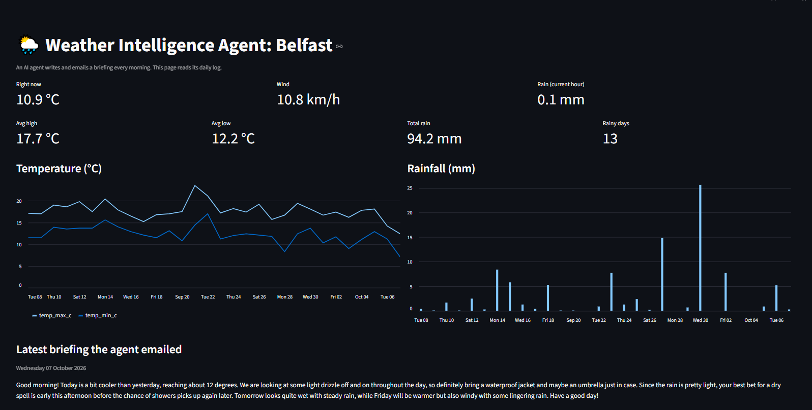
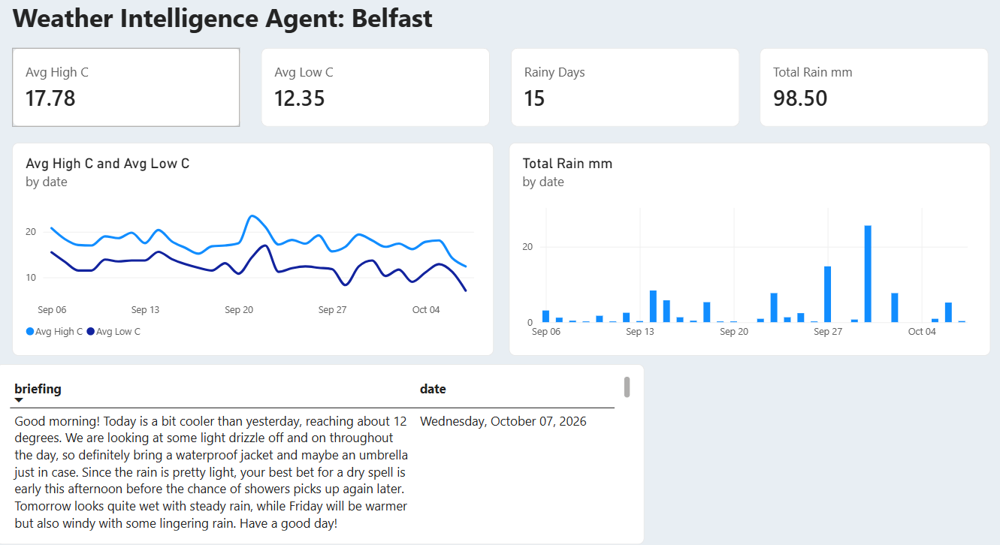
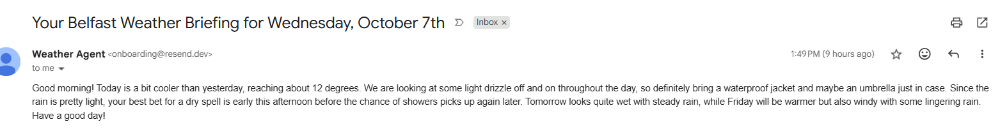

# 🌦️ AI Weather Intelligence Agent

An autonomous AI-powered weather intelligence system that retrieves daily weather data, analyses current and historical conditions, generates a personalised weather briefing, sends it automatically by email, and visualises weather trends through Streamlit and Power BI.

🌐 **Live Dashboard:**  
https://weather-agent-wapsxqltxvstpy8wxnracd.streamlit.app/

---

## 📌 Project Overview

The goal of this project was to build an end-to-end AI and data analytics solution rather than a traditional static weather dashboard.

Every day, the system automatically:

1. Retrieves weather forecasts and recent historical weather data.
2. Allows an AI agent to analyse the conditions using available tools.
3. Generates a natural-language daily weather briefing.
4. Sends the briefing automatically by email.
5. Stores the daily weather information in a historical dataset.
6. Updates dashboards used to analyse weather trends.

The project combines **AI agents, APIs, Python, automation, data analytics, Streamlit and Power BI** in one workflow.

---

## 🖥️ Live Streamlit Dashboard

The Streamlit application provides a live view of current weather conditions and historical weather trends.

It includes:

- Current temperature
- Wind speed
- Current rainfall
- Average high and low temperatures
- Total rainfall
- Number of rainy days
- Historical temperature trends
- Historical rainfall analysis
- Latest AI-generated weather briefing



👉 **[Open the Live Dashboard](https://weather-agent-wapsxqltxvstpy8wxnracd.streamlit.app/)**

---

## 📊 Power BI Analytics Dashboard

A Power BI report was developed using the historical weather log generated by the agent.

The dashboard provides:

- Average high temperature
- Average low temperature
- Rainy-day count
- Total rainfall
- Temperature trend analysis
- Rainfall trend analysis
- Latest AI-generated briefing and date



This demonstrates how the same automated data pipeline can support both an operational web application and a business intelligence reporting environment.

---

## 📧 Automated AI Weather Briefing

The agent generates a personalised briefing based on the weather conditions rather than sending a fixed template.

An example automatically generated email:



The briefing can highlight information such as:

- Temperature changes
- Expected rainfall
- Dry periods
- Wind conditions
- Changes compared with recent weather
- Useful recommendations based on the forecast

---

GitHub Actions
      ↓
   agent.py
      ↓
Google Gemini
  (Tool Use)
   /   |   \
  ↓    ↓    ↓
Forecast Recent Email

GitHub Actions runs the workflow automatically.

The AI agent has access to tools for retrieving forecasts, analysing recent weather and sending email. It uses the available weather information to generate the daily briefing.

The results are then stored in the weather log used by the analytics dashboards.

---

## 🧠 Why This Is an AI Agent

This project goes beyond a traditional fixed weather script.

A standard script follows a predetermined sequence of instructions.

In this project, Claude is provided with tools including:

- Retrieve weather forecast
- Retrieve recent weather
- Send an email

The AI determines how to use the available information and generates a contextual briefing based on current conditions.

As a result, the content changes depending on the weather instead of simply inserting numbers into a fixed template.

---

## 🛠️ Technology Stack

| Technology | Purpose |
|---|---|
| Python | Core application and data processing |
| Claude API | AI reasoning and briefing generation |
| Open-Meteo API | Forecast and historical weather data |
| Pandas | Data manipulation |
| GitHub Actions | Daily workflow automation |
| Streamlit | Live interactive dashboard |
| Power BI | Business intelligence and data visualisation |
| DAX | Power BI calculations and measures |
| CSV | Historical weather data storage |
| Email service | Automated delivery of daily briefings |
| GitHub | Version control and project hosting |

---

## 🔄 Automated Workflow

The complete pipeline operates automatically:

```text
Scheduled Trigger
      ↓
Retrieve Weather Data
      ↓
Analyse Recent Conditions
      ↓
AI Generates Briefing
      ↓
Send Email
      ↓
Store Daily Results
      ↓
Update Historical Dataset
      ↓
Streamlit + Power BI Analytics
```

This allows the project to continue collecting data and producing insights without requiring the application to be manually executed each day.

---

## 📁 Project Structure

```text
weather-agent/
│
├── .github/
│   └── workflows/
│       └── daily.yml
│
├── data/
│   └── weather_log.csv
│
├── agent.py
├── backfill.py
├── common.py
├── dashboard.py
├── powerbi_measures.dax.txt
├── requirements.txt
├── SETUP.md
├── README.md
│
├── streamlit-dashboard.png
├── powerbi-dashboard.PNG
└── sample-email.png
```

---

## ⚙️ Key Design Decisions

### UK-local scheduling
The sending hour is checked using UK local time so daylight-saving changes do not unexpectedly shift the daily briefing.

### Duplicate prevention
Runs on the same day are detected to prevent duplicate daily emails.

### Lightweight data storage
Weather observations are stored in a CSV file in the repository, avoiding the need to maintain a separate database for this portfolio-scale application.

### Shared analytics source
The historical weather log provides a common data source for both Streamlit and Power BI.

### API-based architecture
Weather information is retrieved programmatically through the Open-Meteo API rather than being manually entered.

---

## 🔐 Security

API credentials and email credentials should never be committed directly to the repository.

Sensitive values are stored using environment variables or GitHub repository secrets when the automated workflow runs.

---

## ▶️ Running the Project

Full setup instructions are available in [`SETUP.md`](SETUP.md).

To test the agent without sending an email:

```bash
DRY_RUN=1 python agent.py
```

An Anthropic API key must be configured before running the AI functionality.

---

## 📈 Skills Demonstrated

This project demonstrates practical experience with:

- Python development
- REST API integration
- AI agents and LLM tool use
- Data collection and transformation
- Pandas
- Workflow automation
- GitHub Actions
- Data visualisation
- Power BI
- DAX
- Streamlit
- Dashboard development
- Automated reporting
- Data pipeline design
- Version control with Git/GitHub

---

## 🚀 Future Improvements

Possible future extensions include:

- Multiple-city weather monitoring
- Severe-weather alerts
- Hourly rain notifications
- Telegram or mobile notifications
- SQL/PostgreSQL data storage
- Forecast accuracy analysis
- More advanced anomaly detection
- Additional Power BI analytics
- Personalised alert thresholds

---

## 👤 Author

**Muhammad Haris**

MSc Financial Analytics | Data Analytics | Python | SQL | Power BI | AI & Automation

---

⭐ If you found this project interesting, feel free to explore the repository and the live dashboard.
